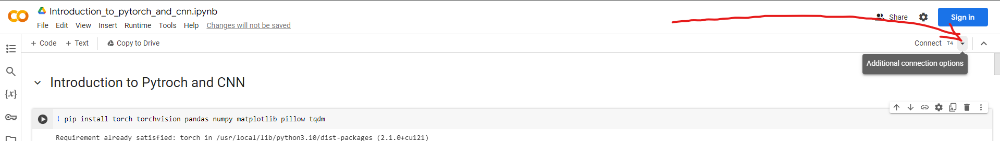
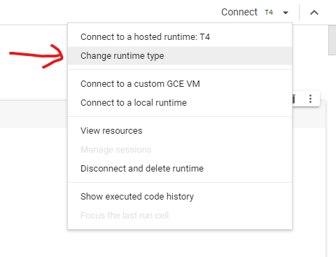
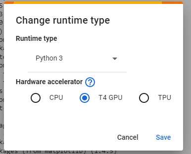

# Course on CNN and Pytorch
Welcome to the "Course on CNN and PyTorch" a structured educational resource designed to deepen your understanding and practical skills with Convolutional Neural Networks (CNNs) using PyTorch.

## Course Overview
This course is structured to provide a step-by-step introduction to the core concepts of deep learning, focusing on CNNs and their implementation in PyTorch. Through this course, you will gain hands-on experience working with datasets, implementing CNN architectures, and training deep learning models efficiently.

## What You Will Learn
* **Introduction to Deep Learning:** Fundamental concepts and applications of deep learning.
* **Datasets and DataLoaders:** How to load, preprocess, and utilize datasets with PyTorch DataLoaders.
* **Convolutional Neural Networks (CNNs):** Architecture, functionality, and significance of Convolutional Neural Networks.
* **Training Loop:** Detailed walkthrough of the training process, including loss calculation and model optimization.
* **Specific CNN Architectures:** Exploration of various CNN designs and their applications.

## Prerequisites
* **Python Programming:** Basic understanding of Python programming.
* **Google Account:** Access to Google Colab for running the code on a T4 GPU.

## How to Use This Notebook
To use this notebook, you open the notebook in Google Colab.
To ensure your models train efficiently, you'll want to use a T4 GPU provided by Google Colab. Here's how to set it up:

1. **Select Runtime Type:** After opening the notebook in Colab, navigate to the "Runtime" menu at the top of the page.
2. **Change Runtime Type:** Click on "Change runtime type" in the drop-down menu.
3. **Enable GPU:** In the dialog that appears, set "Hardware accelerator" to "GPU" and ensure that it's set to use a T4 GPU.

<b>Click to see the detailed instructions </b>

Change the runtime type to "T4 GPU" by clicking on the "Runtime" tab and then "Change runtime type" and then select "T4 GPU" and connect to it as shown in the images below.

Press the "Change runtime type" button to change the runtime type.

After changing the runtime type, the runtime type should be T4 GPU as shown in the image below.

Connect to the hosted runtime and run the cells in the notebook to execute the code and see the results.

The course is designed so you can follow along step-by-step. Each section builds on the previous one, but tasks are self-contained to minimize dependencies.

Feel free to modify the code and experiment. Playing with the parameters and code will help deepen your understanding.

## Contributors
This course was created by one of our most skilled members **Ulrik Røsby** to share his knowledge and expertise with the rest of the members of **Cogito NTNU**. He has designed this course to provide a comprehensive learning experience for anyone interested in deep learning and CNNs using PyTorch.

<table align="center">
    <tr>
        <td align="center">
            <a href="https://github.com/ulrik2204">
                 
                <b>Ulrik Røsby</b>
            </a>
        </td>
    </tr>
</table>